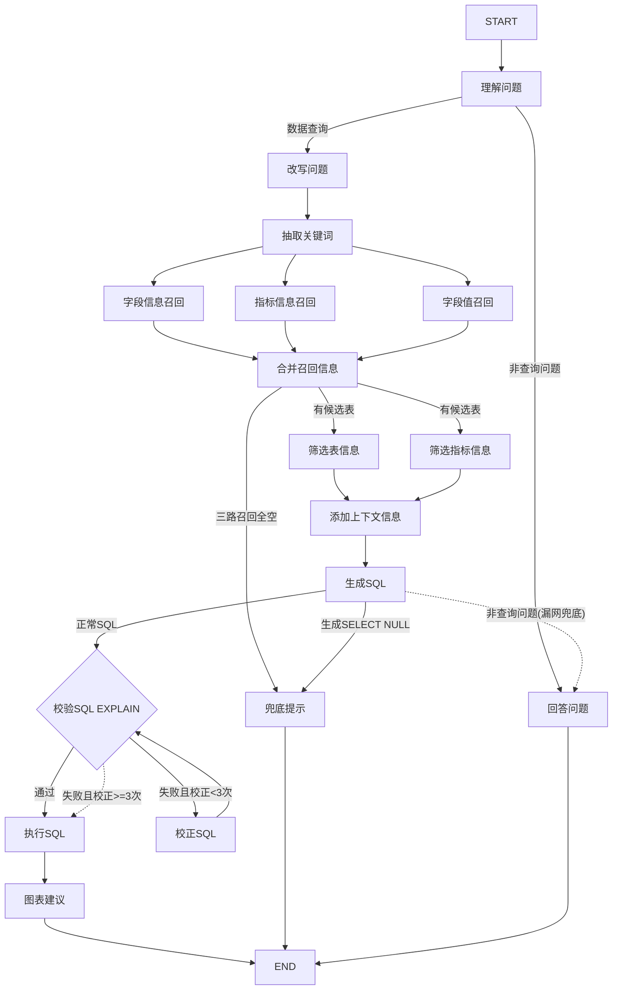

# QueryForge — 基于 LLM 的自然语言查数 Agent

> 用自然语言问数据,Agent 自动完成「召回 → 理解 → 生成 SQL → 校验 → 执行」,以 SSE 流式返回结果表格。

QueryForge 是一个 **Text-to-SQL 智能体**:用户用中文提问(如"统计一下 2025 年 1 月份各品类的销售额占比"),系统通过多路召回(
字段/指标/字段值)+ LLM 生成 + EXPLAIN 校验 + 循环校正,最终在数据仓库上执行 SQL 并把结果以流式表格返回前端,
同时支持将最近一次查询的表格数据一键导出为 Excel 文件。

核心设计是**元数据驱动(metadata-driven)**:数据库的表结构、字段语义、指标口径、字段取值全部抽离为"知识库"(向量库 +
全文索引 + 元数据库)。换一套表结构完全不同的数据库,只需重建知识库,Agent 代码与 Prompt **零改动**即可复用。

---

## ✨ 核心特性

- **多路召回(RAG)**:字段信息(Qdrant 向量)、指标信息(Qdrant 向量)、字段值(ES 全文)三路并行召回,再按需补全,把"
  真实存在的表/字段/取值"喂给 LLM,从源头杜绝"编造列名/表名"。
- **指标口径内置**:指标(如 GMV/AOV)的业务口径、关联字段在知识库中预定义,LLM 生成 SQL 时严格遵循,避免同一指标口径不一致。
- **SQL 校验 + 循环校正**:生成的 SQL 先用 MySQL `EXPLAIN` 校验,失败则 LLM 基于错误信息循环修复(最多 3 次),通过后才执行。
- **无结果兜底**:三路召回落空、或 LLM 生成 `SELECT NULL`(无法把问题映射到任何表)时,返回友好提示并结束流程,不再执行空 SQL
  返回无意义的 NULL 表格。
- **非查询问题智能应答**:问候、闲聊、能力咨询等非查询问题在流程入口「理解问题」节点即被 LLM 识别并分流,直接以
  QueryForge 助手身份用专业系统提示词回答并引导用户提出查询需求,不经过召回链与 SQL 校验/执行环节。
- **SQL 结果可视化**:执行完成后由 LLM 根据结果结构自动建议图表类型(饼图/折线/柱状图/纯表格),以
  `{"chart": ...}` 事件流式推送,前端在表格上方叠加 ECharts 图表;建议失败时自动回退纯表格。
- **最近结果 Excel 导出**:前端仅使用最近一次 `result` 事件中的表格列与行生成 `.xlsx`,不读取图表配置;
  最近一次为非查询回答、空结果或错误时导出空白工作表并给出页面提示,避免误导出更早轮次的数据。
- **多轮对话 + 会话记忆**:所有轮次(查询结果/闲聊回答/无结果)都记入会话历史(最近 5 轮),存入 Redis,
  「改写问题」节点结合历史做指代消解("那3月份呢" → "2025年3月份的GMV是多少"),前端自动管理会话 id,支持"新对话"与"清空聊天记录"。
- **SSE 流式响应**:每个处理阶段以 `{"stage": ...}` 事件实时推送,执行结果以 `{"result": [...]}` 返回,前端逐步渲染"
  步骤进度 + 结果表格 + 图表"。
- **元数据驱动**:换数据库只改 `conf/meta_config.yaml` + 重建知识库,代码与 Prompt 不用动。构建脚本幂等,可重复执行。
- **Docker 一键起基础设施**:MySQL / Elasticsearch / Qdrant / Embedding / Redis 服务全部容器化,附初始化 SQL 与样例数据。

---

## 🧱 技术栈

| 层         | 技术                                                   |
|-----------|------------------------------------------------------|
| 后端框架      | FastAPI + Uvicorn                                    |
| Agent 编排  | LangGraph(状态图)、LangChain                             |
| LLM       | DeepSeek(`deepseek-chat`,temperature=0)              |
| 向量检索      | Qdrant(余弦相似度,1024 维)                                 |
| Embedding | Text Embeddings Inference + `BAAI/bge-large-zh-v1.5` |
| 全文检索      | Elasticsearch(`ik_max_word` 分词)                      |
| 元数据/数据仓库  | MySQL 8.0(SQLAlchemy + asyncmy)                      |
| 会话记忆      | Redis 7(redis-py,List 存储最近 N 轮历史)               |
| 分词        | jieba                                                |
| 前端        | Vue 3 + Vite + ECharts                                |
| 配置        | OmegaConf(严格校验)                                      |

---

## 🏗️ 系统架构

```
┌─────────────┐     ┌──────────────────────────────────────────────┐
│  Vue3 前端   │ ──► │  FastAPI 后端  /api/query  (SSE 流式)          │
│  (SSE 渲染)  │ ◄── │  ChatService → LangGraph 状态图(17 节点)      │
└─────────────┘     └──────────────┬───────────────────────────────┘
                                   │
        ┌──────────┬───────────────┼────────────────┬──────────────┐
        ▼          ▼               ▼                ▼              ▼
   ┌─────────┐ ┌─────────┐  ┌─────────────┐  ┌────────────┐  ┌───────────┐
   │  meta 库 │ │  dw 库   │  │  Qdrant      │  │Elasticsearch│ │ Embedding │
   │(表/字段/ │ │(数据仓库) │  │(字段+指标向量)│  │ (字段值全文) │ │ 服务:8081  │
   │  指标)   │ │         │  │ :6333       │  │   :9200     │ │           │
   └─────────┘ └─────────┘  └─────────────┘  └────────────┘  └───────────┘
                                   │
                                   ▼
                            ┌─────────────┐
                            │ Redis :6380  │
                            │ (会话历史记忆) │
                            └─────────────┘
```

**两类 MySQL 库的分工:**

| 库      | 作用                                | 写入时机   |
|--------|-----------------------------------|--------|
| `meta` | 元数据:表/字段/指标定义(结构 + 描述 + 别名 + 示例值) | 知识库构建时 |
| `dw`   | 数据仓库:真正的业务数据,Agent 最终在这里执行 SQL    | 业务数据   |

---

## 🔄 工作原理:Agent 流程

完整流程图(`app/agent/graph.py`):



### 各节点职责

| 节点                     | 职责     | 说明                                                                            |
|------------------------|--------|-------------------------------------------------------------------------------|
| `classify_query`       | 理解问题  | 流程入口:LLM 判断用户输入是否为数据查询请求。非查询问题直接路由到 `answer_question`,不经过召回链               |
| `rewrite_query`        | 改写问题  | 多轮指代消解:结合会话历史(Redis 中最近 N 轮问题+结果概要)把当前问题改写为独立完整的查询;无历史/无指代时原样输出    |
| `extract_keywords`     | 抽取关键词  | jieba 分词(限定词性)+ 整句加入 + 过滤纯数字                                                  |
| `column_recall`        | 字段信息召回 | LLM 扩展关键词 → 逐词向量化 → Qdrant `queryforge_column` 检索(score≥0.6, top5)→ 按字段 id 去重 |
| `metric_recall`        | 指标信息召回 | 同上,检索 Qdrant `queryforge_metric`(指标口径/别名)                                     |
| `value_recall`         | 字段值召回  | LLM 扩展取值候选 → ES `queryforge` 索引 `match` 全文检索(min_score≥0.6, top5)→ 按 id 去重    |
| `merge_retrieved_info` | 合并召回信息 | 字段值并入所属字段 examples;指标关联字段、主外键列从 meta 库补全;组装成表结构                               |
| `filter_table_info`    | 筛选表信息  | LLM 裁剪候选表与列,只留本次查询必需的                                                         |
| `filter_metric_info`   | 筛选指标信息 | LLM 裁剪指标,只留本次查询用到的                                                            |
| `no_result`            | 无结果兜底  | 合并后无任何候选表、或 LLM 生成 `SELECT NULL` 时,直接返回友好提示并结束流程(不再执行空 SQL)                   |
| `add_context`          | 添加上下文  | 当前日期(年月日/星期/季度)+ 数据库方言与版本                                                     |
| `generate_sql`         | 生成 SQL | 把表/指标/时间/DB 信息 + 用户问题交给 LLM;LLM 先判断是否查询问题,非查询问题输出 `NOT_A_QUERY` 标记,否则输出纯文本 SQL |
| `answer_question`      | 回答问题  | 非查询问题(问候/闲聊/能力咨询等)兜底:以 QueryForge 助手身份用系统提示词直接回答并引导用户提出查询需求,跳过 SQL 校验/执行;回答写入会话历史    |
| `validate_sql`         | 校验 SQL | 对 DW 库执行 `EXPLAIN`,语法/表/列/函数错误在此暴露                                            |
| `correct_sql`          | 校正 SQL | 基于校验错误信息让 LLM 最小化修复,修复后**重新回到校验节点**(最多 3 轮)                                   |
| `execute_sql`          | 执行 SQL | 在 DW 库执行查询,结果经 SSE 推给前端,并写入 state 供图表建议节点使用                              |
| `chart_suggest`        | 图表建议  | 基于结果列名与样例行让 LLM 建议图表类型(bar/line/pie);`table` 或不适合图表时不发事件,前端回退纯表格     |

---

## 📁 目录结构

```
queryforge/
├── main.py                       # FastAPI 入口(uvicorn main:app)
├── pyproject.toml                # 后端依赖 + pytest 配置
├── tests/                        # pytest 单元测试(路由/校验/prompt/图结构)
│   ├── test_routing.py           # 四个条件路由的三分支行为
│   ├── test_schemas.py           # QuerySchema 入参校验
│   ├── test_prompts.py           # Prompt 模板加载/转义/渲染
│   ├── test_graph.py             # LangGraph 编译与关键边结构
│   └── test_correct_loop.py      # 「校验→校正」循环(含 integration 标记,需真实 MySQL)
├── evals/                        # 评估与测试资产
│   ├── datasets/dataset.yaml     # 102 条评估集(11 类,含黄金 SQL)
│   ├── scripts/                  # 评估/校验/召回实验/压测/多轮检查脚本
│   ├── reports/                  # 完整评估与压测的历史 JSON 报告
│   ├── docs/OPTIMIZATION_REPORT.md # 准确率优化与实验总结
│   └── README.md                 # 目录说明与脚本执行命令
├── .github/workflows/ci.yml      # GitHub Actions:push 后自动跑 pytest
├── conf/
│   ├── app_config.yaml           # 运行配置(数据库/向量库/ES/LLM)
│   ├── app_config.yaml.example   # 配置模板(推送 GitHub 用)
│   └── meta_config.yaml          # 元数据知识库定义(表/字段/指标)
├── prompts/                      # 各节点的 LLM Prompt
│   ├── classify_query.prompt     # 入口问题分类(数据查询 vs 非查询)
│   ├── extend_keywords*.prompt
│   ├── generate_sql.prompt
│   ├── answer_question.prompt    # 非查询问题应答的系统提示词
│   ├── rewrite_query.prompt      # 多轮指代消解(结合会话历史改写问题)
│   ├── chart_suggest.prompt      # 图表类型建议(bar/line/pie/table)
│   ├── filter_table_info.prompt
│   ├── filter_metric_info.prompt
│   ├── correct_sql.prompt
│   └── ...
├── app/
│   ├── agent/                    # LangGraph 状态图 + 17 个节点
│   │   ├── graph.py              # 图编排(校验-校正循环路由 + 无结果兜底路由)
│   │   ├── state.py              # QueryForgeState / context
│   │   ├── llm.py                # LLM 客户端
│   │   └── nodes/                # 各节点实现(含 classify_query / rewrite_query / no_result / answer_question / chart_suggest)
│   ├── api/                      # FastAPI 路由 /api/query(SSE)
│   ├── service/                  # ChatService / MetaKnowledgeService / ConversationService(会话历史)
│   ├── repositories/             # MySQL / Qdrant / ES 仓储层
│   ├── models/                   # 各存储的模型定义(TypedDict / SQLAlchemy)
│   ├── clients/                  # 各客户端单例管理(含 redis_client)
│   ├── scripts/                  # 知识库构建脚本
│   └── core/                     # 中间件/日志/lifespan
├── docker/
│   ├── docker-compose.yaml       # 一键起 MySQL/ES/Kibana/Qdrant/Embedding/Redis
│   ├── mysql/                    # 建库 SQL(dw.sql 含样例数据、meta.sql)
│   └── embedding/                # bge-large-zh-v1.5 模型文件
└── queryforge-frontend/         # Vue3 前端(Vite,SSE 渲染)
```

---

## 🚀 快速开始

### 环境要求

- Docker + Docker Compose
- Python ≥ 3.11
- Node.js ≥ 18
- 一个 OpenAI 兼容的 LLM API Key(默认 `deepseek-chat`)

### 第 1 步:启动基础设施(Docker)

在 `docker/` 目录执行:

```bash
cd docker
docker compose up -d
```

将启动:

| 服务            | 端口        | 说明                                 |
|---------------|-----------|------------------------------------|
| mysql         | 3306      | 自动执行 `mysql/*.sql` 建库 + 灌入 dw 样例数据 |
| elasticsearch | 9200      | 字段值全文索引                            |
| kibana        | 5601      | ES 可视化(可选)                         |
| qdrant        | 6333/6334 | 字段与指标向量库                           |
| embedding     | 8081      | bge-large-zh-v1.5 Embedding 服务     |
| redis         | 6380      | 会话历史存储(多轮对话记忆,宿主机 6379 若被占用则用 6380) |

> 首次启动需确保 `docker/embedding/bge-large-zh-v1.5` 下已放置模型文件(从 HuggingFace 下载 `BAAI/bge-large-zh-v1.5` 的
`model.safetensors`、`config.json` 等)。

> 初始化 SQL(`docker/mysql/*.sql`)会在 MySQL 首次启动时自动创建与 `conf/app_config.yaml` 一致的
> `queryforge` 用户并授予 `meta`/`dw` 库权限,容器起来后无需手工建用户即可直接连接。

### 第 2 步:配置后端

```bash
# 复制配置模板并填写
cp conf/app_config.yaml.example conf/app_config.yaml
```

按环境修改 `conf/app_config.yaml`(数据库账号密码、LLM `api_key` 等,详见下文「配置说明」)。

安装依赖并启动后端:

```bash
# 建议使用 venv
python -m venv .venv
.venv/Scripts/activate        # Windows
# source .venv/bin/activate  # Linux/macOS

pip install -e .
uvicorn main:app --host 0.0.0.0 --port 8000
```

### 第 3 步:构建元数据知识库

Agent 运行前,必须先把 `conf/meta_config.yaml` 中定义的表/字段/指标同步到 meta 库、Qdrant、ES:

```bash
.venv/Scripts/python app/scripts/build_meta_knowledge.py -c conf/meta_config.yaml
```

该脚本会:采样 dw 库字段值 → 写入 meta 库 → 字段/指标按 name/description/alias 向量化写入 Qdrant → `sync: true` 的字段全量取值写入
ES。

> **构建幂等**:脚本每次运行前会先清空 meta 库、重建 Qdrant 集合、删除并重建 ES 索引,再全量构建。
> 因此可放心重复执行;修改 `meta_config.yaml` 后重新运行即可,不会出现主键冲突或旧数据残留。
> 脚本启动时还会先轮询等待 MySQL/Qdrant/ES/Embedding 全部就绪(最长 5 分钟),因此删除数据卷重启
> Docker 后无需掐时机,直接运行构建脚本即可,它会等基础设施初始化完成再开始构建。

### 第 4 步:启动前端

```bash
cd queryforge-frontend
npm install
npm run dev        # http://localhost:5173,Vite 已配置 /api 代理到 :8000
```

### 运行测试(可选)

项目内置 pytest 单元测试(路由分支/入参校验/Prompt 模板/图结构),零外部依赖、秒级完成:

```bash
pip install -e ".[dev]"                     # 安装含 pytest 的开发依赖(首次)
.venv/Scripts/python -m pytest tests/        # 单元测试(默认跳过 integration)
.venv/Scripts/python -m pytest tests/ -m integration   # 集成测试(需启动 MySQL 后手动运行)
```

提交代码到 GitHub 后,CI(GitHub Actions)会自动运行单元测试,失败会在提交记录中标红。

### 验证

浏览器打开 `http://localhost:5173`,输入:

```
统计一下2025年1月份各品类的销售额占比
```

前端会逐步显示「理解问题 → 抽取关键词 → 召回字段信息/指标信息/字段值 → 合并 → 筛选 → 生成SQL → 验证SQL → 执行SQL → 生成图表」,最终渲染结果表格与图表。

也可直接调用 API:

```bash
curl -N -X POST http://localhost:8000/api/query \
  -H "Content-Type: application/json" \
  -d '{"query": "统计一下2025年1月份各品类的销售额占比"}'
```

---

## ⚙️ 配置说明

### `conf/app_config.yaml`

| 配置块         | 字段                               | 说明                                       |
|-------------|----------------------------------|------------------------------------------|
| `logging`   | `file` / `console`               | 日志开关、级别、路径、轮转                            |
| `db_meta`   | host/port/user/password/database | 元数据库(默认 `meta`)                          |
| `db_dw`     | host/port/user/password/database | 数据仓库库(默认 `dw`)                           |
| `qdrant`    | host/port/embedding_size         | 向量库地址,`embedding_size` 必须与模型输出维度一致(1024) |
| `embedding` | host/port/model                  | Embedding 服务地址与模型                        |
| `es`        | host/port/index_name             | 全文索引地址与索引名(默认 `queryforge`)              |
| `llm`       | model_name/api_key               | LLM 模型与 API Key                          |
| `redis`     | host/port/db/max_history         | 会话历史存储;`max_history` 为多轮记忆保留的最大轮数(默认 5) |

### `conf/meta_config.yaml`(知识库定义)

```yaml
tables:
  - name: dim_region          # 与 dw 库真实表名一致
    role: dim                 # fact / dim
    description: 地区维度表...
    columns:
      - name: province
        role: dimension       # primary_key / foreign_key / dimension / measure
        description: 订单所属的省份名称
        alias: [ 省份, 省, 所在省份 ]   # 业务别名(召回的关键)
        sync: true            # true 时该字段取值会全量同步进 ES 供字段值召回
metrics:
  - name: GMV
    description: 所有订单的成交金额总和
    relevant_columns: [ fact_order.order_amount ]   # 指标关联字段
    alias: [ 成交总额, 订单总额 ]
```

**要点**:

- `alias` 是"用户说法 → 库字段"的桥梁,写得好坏直接影响召回质量。
- `sync: true` 仅用于需要按取值过滤的维度列(如省份、品类),度量列无需同步。

---

## 📡 API 文档

### `POST /api/query`

**请求**

```json
{
  "query": "那3月份呢",
  "session_id": "可选,续接多轮记忆;不传则服务端新建会话"
}
```

`query` 不能为空串,空白字符串会被拒绝并返回 HTTP `422`(入参校验在 Pydantic 层完成,不会进入 Agent 流程)。
`session_id` 用于多轮对话:同一会话的追问(如"那3月份呢")会被「改写问题」节点结合历史补全为完整查询。

**响应**:SSE 流(`text/event-stream`),每行 `data: {...}`。首个事件为会话标识
`{"session_id": "..."}`(新建会话时回传,客户端保存后用于后续请求)。

**事件类型**

| 事件    | 示例                                                             | 说明                           |
|-------|----------------------------------------------------------------|------------------------------|
| 会话事件  | `{"session_id": "abc123..."}`                                  | 新建会话时回传的会话标识(首个事件)           |
| 阶段事件  | `{"stage": "生成SQL"}`                                           | 当前处理阶段;「改写问题」事件可带 `detail` 展示补全后的问题 |
| 结果事件  | `{"result": [{"category": "手机数码", ...}]}`                      | 最终查询结果(行字典数组)                |
| 错误事件  | `{"error": "查询执行失败，请尝试换个说法重新提问", "detail": "(asyncmy...)..."}` | 失败时的友好提示 + 技术细节              |
| 无结果事件 | `{"error": "没有找到与问题相关的数据，请尝试换个说法提问", "detail": "..."}`         | 召回落空或 LLM 无法生成可执行 SQL 时的兜底提示 |
| 回答事件  | `{"answer": "你好！我是 QueryForge..."}`                        | 非查询问题的 LLM 直接回答(助手身份,经系统提示词约束)  |
| 图表事件  | `{"chart": {"type": "pie", "x": "category", "y": ["sales_ratio"], "title": "各品类销售额占比"}}` | 结果图表的 LLM 建议(bar/line/pie),前端叠加 ECharts 渲染 |

**一次成功请求的完整事件序列**:

```
{"session_id":"abc123..."}                                                        # 新建会话时回传(首个事件)
{"stage":"理解问题"}                                                          # 入口分类(数据查询)
{"stage":"改写问题"}                                                          # 多轮指代消解(仅在发生改写时出现)
{"stage":"抽取关键词"}
{"stage":"召回字段信息"} / {"stage":"召回指标信息"} / {"stage":"召回字段值"}   # 三路并行
{"stage":"合并召回信息"}
{"stage":"筛选指标信息"} / {"stage":"筛选表信息"}                               # 并行
{"stage":"添加上下文信息"}
{"stage":"生成SQL"}
{"stage":"验证SQL语句"}
{"stage":"执行SQL语句"}
{"result":[...]}                                                              # 表格先渲染
{"stage":"生成图表"}                                                            # 图表建议节点(与其余节点一样流式提示)
{"chart":{...}}                                                              # 图表建议(LLM 判定,可缺席)
```

若校验失败,中间会出现一个或多个 `{"stage":"校正SQL"}` 事件(循环修复,最多 3 次)。

若三路召回落空、或 LLM 生成 `SELECT NULL`(无法将问题映射到任何表),流程会在「合并召回信息」或「生成SQL」
之后直接结束,并返回上面的无结果事件,不会执行空 SQL。

若用户的问题是非查询问题(问候、闲聊、能力咨询等),流程在入口「理解问题」节点即被识别,只推送
`{"stage":"理解问题"}` 与 `{"stage":"回答问题"}` 两个阶段,随后以回答事件(`{"answer": ...}`)直接回复,
不会出现召回链与「验证SQL语句」「执行SQL语句」等阶段(`generate_sql` 节点仍保留 `NOT_A_QUERY` 判断作为漏网兜底)。

### `DELETE /api/session/{session_id}`

删除单个会话:清空 Redis 中该会话的历史记录。

**请求**

```http
DELETE /api/session/abc123...
```

**响应**

```json
{"ok": true, "session_id": "abc123..."}
```

### `DELETE /api/sessions`

清空所有会话:删除 Redis 中全部会话历史(防止会话数据无限增长)。

**请求**

```http
DELETE /api/sessions
```

**响应**

```json
{"ok": true, "cleared": "all"}
```

前端「清空聊天记录」按钮调用此接口,清空成功后同时清除本地会话标识与消息列表。

---

## 🛠️ 常见问题

**Q:Embedding 服务起不来 / 模型加载失败?**
确认 `docker/embedding/bge-large-zh-v1.5` 下模型文件完整;启动日志报错可 `docker compose logs embedding` 查看。

**Q:请求返回"查询执行失败"?**

- 查看后端 `logs/app.log` 中的 `detail` 原始错误;
- 常见原因:知识库未构建(缺表/字段/指标)、dw 库无数据、LLM API Key 失效。

**Q:请求返回"没有找到与问题相关的数据"?**
这是无结果兜底(`no_result` 节点)的提示,说明三路召回都没有命中知识库、或 LLM 无法把问题映射到任何表。
通常是问题过于宽泛/与业务无关,换个说法重试即可;若问题本应可查,检查 `meta_config.yaml` 的 `alias` 是否覆盖了该说法。

**Q:召回不到想要的字段?**
检查 `conf/meta_config.yaml` 中该字段的 `alias` 是否覆盖了用户的常见说法,然后重新执行知识库构建脚本。

**Q:改了 meta_config 不生效?**
知识库是构建时写入的,修改配置后必须重新运行 `build_meta_knowledge.py`。构建脚本每次运行前会自动清空
meta 库/Qdrant/ES 中的旧知识库再重建,重复执行不会报错。

---

## 📌 已知限制与改进方向

- **数据库方言绑定 MySQL**:`DWMySQLRepository` 使用了 `show columns`、`explain`、`select version()` 等 MySQL 语法,换
  PG/Oracle 需改造该仓储层。
- **存储引擎绑定**:repository 直接依赖 `AsyncQdrantClient` / `AsyncElasticsearch`,如需换向量库/检索后端需抽象 client 层。
- **`value_recall` 返回 `dict_values` 视图**而非 `list`,与另两个召回节点不一致,建议统一。
- **指标关联字段不传递给 LLM**:`merge_retrieved_info` 将指标转为 `MetricInfoState` 时丢弃了 `relevant_columns`,LLM
  只能靠指标描述理解口径。
- **LLM 生成 SQL 存在随机性**:同一问题多次生成可能得到语义不同但语法都合法的 SQL(例如对 `date_id` 格式的错误猜测),
  `EXPLAIN` 校验无法拦截这类语义错误。缓解手段:在 `generate_sql.prompt` 或字段 `description` 中明确关键字段的取值格式。
- **会话历史存于 Redis**:多实例部署天然共享;所有轮次(查询结果/回答/无结果)均记录,历史窗口默认最近 5 轮
  (`redis.max_history` 配置)。会话记录无过期时间,可通过 `DELETE /api/sessions` 手动清空,或后续加 TTL。

---

## 📄 License

仅供学习参考,无开源许可证。
